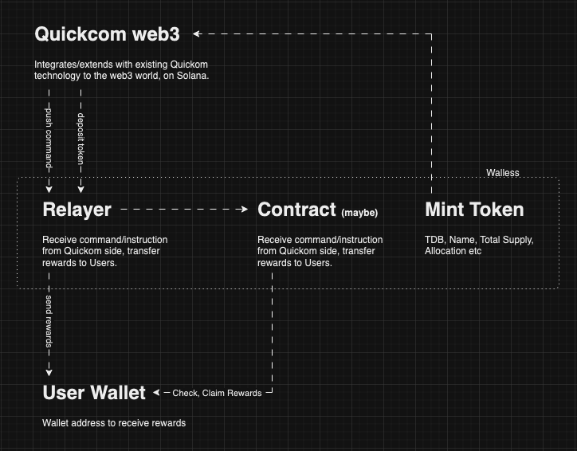

# Public part of quikom web3 infrastructure

### Pre-requisites
- Install Node.js, suggested `version@20.11.1`
- Yarn `v4`, [installation instruction here](https://yarnpkg.com/getting-started/install)
- Install `metacraft` CLI via `npm i -g metacraft-cli`, suggested `version@0.0.87+`

### Development
- Run `yarn dev` or `metacraft` to launch development server

### Deployment
- Run `yarn deploy --stage [development | production | staging]` to deploy under AWS, as a Serverless stack

### Conventions
- Enable EsLint on your Code Editor/IDE, enable format-on-save to keep your code always in the right format

### Project diagram



### Api endpoints
- Use `send-reward` to command sending reward, see following endpoint/shape as reference:
```bash
curl --location 'https://71rvypwwrc.execute-api.ap-south-1.amazonaws.com/send-reward' \
--header 'Content-Type: application/json' \
--data '{
    "walletAddress": "C8CAdCM27ad3W1XGW8CAbjJXoieesK1ggN8GQyAfn2vb",
    "amount": "1000",
    "resource": {
        "time": 4321,
        "banwhich": 1234
    }
}'
```
notes: `resource` field is absolutely optional, feel free to propose any shape that best fit Quickom interface.


- use `estimate-fee` to estimate fee for the transaction before actually calling it, have the same param/args as `send-reward`:
```bash
curl --location 'https://71rvypwwrc.execute-api.ap-south-1.amazonaws.com/estimate-fee' \
--header 'Content-Type: application/json' \
--data '{
    "walletAddress": "C8CAdCM27ad3W1XGW8CAbjJXoieesK1ggN8GQyAfn2vb",
    "amount": "2.5"
}'
```


- Use `keypair` to get/generate Solana keypair, this would not store anything on the Relay, see following endpoint/shape as reference:
```bash
curl --location 'https://71rvypwwrc.execute-api.ap-south-1.amazonaws.com/keypair'
```
